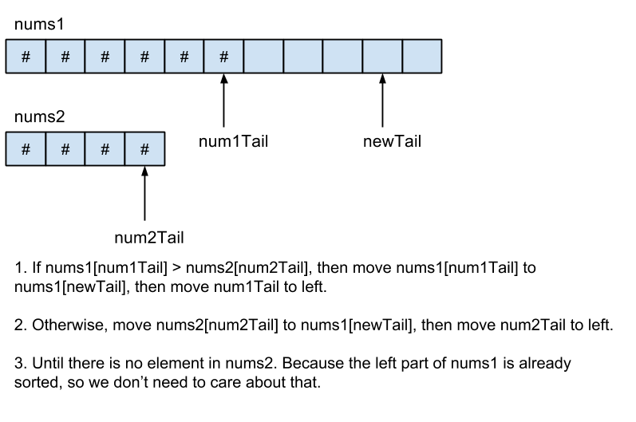

# Merge Two Sorted Array

### Question:

Given two sorted integer arrays nums1 and nums2, merge nums2 into nums1 as one sorted array.

Note:
nums1 has enough space (size that is greater or equal to m + n) to hold additional elements from nums2. The number of elements initialized in nums1 and nums2 are m and n respectively.

---

### Think out loud:

Since nums1 has enough space to hold nums1 and nums2. We can fill nums1 from right to left.

mergeSortedArray:



---

### Show me your code:

##### CPP Code

```cpp
void merge(vector<int>& nums1, int m, vector<int>& nums2, int n) {
    int new_tail = m + n - 1;
    int nums1_index = m - 1;
    int nums2_index = n - 1;
    while(nums2_index >= 0) {
        //as long as there are still elements in nums2, keep looping!
        //And make sure check num1Tail >= 0
        if(nums1_index >= 0 && nums1[nums1_index] > nums2[nums2_index]) {
            nums1[new_tail] = nums1[nums1_index];
            nums1_index--;
        }
        else {
            nums1[new_tail] = nums2[nums2_index];
            nums2_index--;
        }
        new_tail--;
    }
}
```

##### Java Code

```java
public void merge(int[] nums1, int m, int[] nums2, int n) {
    int num1Tail = m - 1;
    int num2Tail = n - 1;
    int newTail = m + n - 1;

    while(num2Tail >= 0) {
    //as long as there are still elements in nums2, keep looping!
    //And make sure check num1Tail >= 0
        if(num1Tail >= 0 && nums1[num1Tail] > nums2[num2Tail]) {
            nums1[newTail] = nums1[num1Tail];
            num1Tail--;
        }
        else {
            nums1[newTail] = nums2[num2Tail];
            num2Tail--;
        }
        newTail--;
    }
}
```

##### Javascript Code

```javascript
/**
 * @param {number[]} nums1
 * @param {number} m
 * @param {number[]} nums2
 * @param {number} n
 * @return {void} Do not return anything, modify nums1 in-place instead.
 */
var merge = function(nums1, m, nums2, n) {
    const nums1_index = m - 1;
    const nums2_index = n - 1;
    const new_tail = m + n - 1;
    while (nums2_index >= 0) {
        if (nums1_index >= 0 && nums1[nums1_index] > nums2[nums2_index]) {
            nums1[new_tail] = nums1[nums1_index];
            nums1_index--;
        } else {
            nums1[new_tail] = nums2[nums2_index];
            nums2_index--;
        }
        new_tail--;
    }
};
```

